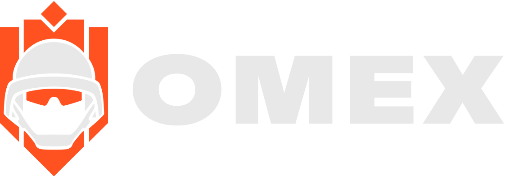

# OMEX - Domine o Mapa

<div align="center">
  

  **Website oficial do servidor OMEX FiveM**

  [](https://reactjs.org/)
  [](https://www.typescriptlang.org/)
  [](https://vitejs.dev/)
  [](https://tailwindcss.com/)
  [](https://www.gnu.org/licenses/gpl-3.0)
</div>

---

## 📋 Sobre o Projeto

> OMEX foi um servidor de Grand Theft Auto V modificado via FiveM, oferecendo uma experiência única de jogo multiplayer com foco em modos competitivos, ranking personalizado e economia de personalização.

Website moderno e responsivo desenvolvido para apresentar o servidor OMEX FiveM, com suporte a múltiplos idiomas, sistema de ranking, galeria de personalizações e integração direta com a plataforma FiveM.

### ✨ Características Principais

- 🌍 **Suporte Multilíngue** - Português (BR) e Inglês (US) com detecção automática
- 🎮 **4 Modos de Jogo** - Confrontation, Collapse, Domination e Free Fall
- 🏆 **Sistema de Ranking** - Levels, ELO e Conquistas
- 🎨 **Galeria de Personalização** - Showcase de veículos, armas e roupas
- 📱 **Design Responsivo** - Otimizado para desktop e mobile
- ⚡ **Performance Otimizada** - Vite + SWC para builds ultra-rápidos
- 🎬 **Vídeo Background** - Carregamento progressivo em chunks
- 🔗 **Integração FiveM** - Conexão direta ao servidor

---

## 🚀 Instalação e Configuração

### Pré-requisitos

- [Node.js](https://nodejs.org/) (versão 18.x ou superior)
- Git (para clonar o repositório)

### Passos de Instalação

1. **Clone o repositório**

   ```bash
   git clone https://github.com/seu-usuario/omex-website.git
   cd omex-website
   ```

2. **Instale as dependências**

   ```bash
   npm install
   ```

3. **Inicie o servidor de desenvolvimento**

   ```bash
   npm run dev
   ```

   O site estará disponível em `http://localhost:5173`

4. **Build para produção**

   ```bash
   npm run build
   ```

   Os arquivos otimizados serão gerados na pasta `dist/`

5. **Preview da build de produção**

   ```bash
   npm run preview
   ```

### Scripts Disponíveis

| Comando | Descrição |
|---------|-----------|
| `npm run dev` | Inicia servidor de desenvolvimento com hot-reload |
| `npm run build` | Compila TypeScript e gera build otimizada para produção |
| `npm run lint` | Executa ESLint para verificar qualidade do código |
| `npm run preview` | Visualiza a build de produção localmente |

---

## 🏗️ Estrutura do Projeto

```
omex-website/
├── public/                    # Arquivos estáticos públicos
│   ├── favicons/             # Ícones do site
│   ├── flags/                # Bandeiras de idiomas (br.svg, us.svg)
│   └── locales/              # Arquivos de tradução JSON
│       ├── br/               # Traduções em Português
│       └── us/               # Traduções em Inglês
├── src/
│   ├── assets/               # Assets importados pelo código
│   │   ├── fonts/            # Fontes customizadas (ABC Ginto Discord)
│   │   ├── images/           # Imagens e ícones
│   │   │   ├── background/   # Backgrounds dos modos de jogo
│   │   │   ├── items/        # Veículos e armas (20 imagens)
│   │   │   └── vectors/      # SVGs (logos, social media)
│   │   └── videos/           # Vídeo do hero background
│   ├── components/           # Componentes reutilizáveis
│   │   ├── ui/               # Componentes UI (Radix UI)
│   │   ├── BorderDec.tsx     # Decoração de bordas
│   │   ├── Countdown.tsx     # Contagem regressiva
│   │   ├── GameModeCard.tsx  # Card de modo de jogo
│   │   ├── ItemsCard.tsx     # Card de item
│   │   ├── LanguageMenu.tsx  # Seletor de idioma
│   │   ├── MobileMenu.tsx    # Menu mobile
│   │   ├── PrimaryButton.tsx # Botão principal
│   │   └── VideoPlayer.tsx   # Player com chunked loading
│   ├── layout/               # Componentes de layout
│   │   ├── Header.tsx        # Cabeçalho com navegação
│   │   └── Footer.tsx        # Rodapé com links
│   ├── pages/                # Páginas da aplicação
│   │   ├── Home/             # Página inicial
│   │   │   ├── index.tsx
│   │   │   └── Sessions/     # Seções da home
│   │   │       ├── Hero.tsx
│   │   │       ├── Games.tsx
│   │   │       ├── Ranking.tsx
│   │   │       ├── Personalize.tsx
│   │   │       └── Connection.tsx
│   │   ├── DiscordRules.tsx  # Regras do Discord
│   │   ├── ServerRules.tsx   # Regras do Servidor
│   │   ├── Privacy.tsx       # Política de Privacidade
│   │   └── Terms.tsx         # Termos de Serviço
│   ├── lib/                  # Utilitários
│   │   └── utils.ts
│   ├── i18n.tsx              # Configuração i18next
│   ├── Router.tsx            # Definição de rotas
│   ├── main.tsx              # Ponto de entrada
│   └── index.css             # Estilos globais + Tailwind
├── index.html                # HTML template
├── vite.config.ts            # Configuração Vite
├── tsconfig.json             # Configuração TypeScript
├── eslint.config.js          # Configuração ESLint
├── components.json           # Configuração shadcn/ui
└── package.json              # Dependências e scripts
```

---

## 🛠️ Stack Tecnológica

### Core

- **[React 19](https://react.dev/)** - Biblioteca UI com latest features
- **[TypeScript](https://www.typescriptlang.org/)** - Type safety e IntelliSense
- **[Vite](https://vitejs.dev/)** - Build tool ultra-rápido
- **[React Router](https://reactrouter.com/)** - Roteamento SPA

### Styling

- **[Tailwind CSS v4](https://tailwindcss.com/)** - Utility-first CSS framework
- **[Radix UI](https://www.radix-ui.com/)** - Componentes acessíveis e sem estilo
- **[Class Variance Authority](https://cva.style/)** - Variantes de componentes
- **[tw-animate-css](https://www.npmjs.com/package/tw-animate-css)** - Animações Tailwind

### Internacionalização

- **[i18next](https://www.i18next.com/)** - Framework de tradução
- **[react-i18next](https://react.i18next.com/)** - Integração React
- **[i18next-http-backend](https://github.com/i18next/i18next-http-backend)** - Carregamento de traduções
- **[i18next-browser-languagedetector](https://github.com/i18next/i18next-browser-languageDetector)** - Detecção automática de idioma

### Ferramentas de Desenvolvimento

- **[ESLint](https://eslint.org/)** - Linting de código
- **[SWC](https://swc.rs/)** - Compilador Rust para JS/TS (mais rápido que Babel)

---

## 📝 TODO - Melhorias Futuras

### 🚧 Features Não Implementadas

- [ ] **Página de Ranking Completa** - Atualmente apenas seção informativa existe
  - [ ] Integração com API de ranking real
  - [ ] Tabela de leaderboard com filtragem
  - [ ] Perfis de jogadores individuais
  - [ ] Histórico de ELO e progressão

### 🎨 Melhorias de UI/UX

- [ ] **Loading States** - Adicionar skeletons e spinners
- [ ] **Animações de Página** - Transições suaves entre rotas
- [ ] **Error Boundaries** - Tratamento de erros React
- [ ] **404 Page** - Página customizada de not found
- [ ] **Acessibilidade Keyboard Navigation** - Navegação completa por teclado

### 🔧 Melhorias Técnicas

#### Acessibilidade (WCAG 2.1 AA)

- [ ] **Audit Completo** - Usar ferramentas como axe-core
- [ ] **Screen Reader Testing** - Testar com NVDA/JAWS
- [ ] **Keyboard Navigation** - Testar navegação por teclado
- [ ] **Color Contrast** - Verificar contraste WCAG AA
- [ ] **Focus Indicators** - Melhorar indicadores de foco
- [ ] **ARIA Labels** - Adicionar labels em todos os elementos interativos

#### SEO

- [ ] **Meta Tags Dinâmicas** - Por página usando React Helmet
- [ ] **Sitemap.xml** - Gerar sitemap automaticamente
- [ ] **Robots.txt** - Configurar corretamente
- [ ] **Structured Data** - Adicionar Schema.org JSON-LD
- [ ] **Open Graph** - Tags OG para redes sociais
- [ ] **Canonical URLs** - Prevenir conteúdo duplicado

### 🌍 Internacionalização

- [ ] **Mais Idiomas** - Adicionar Espanhol, Francês, etc.
- [ ] **RTL Support** - Suporte para idiomas RTL (árabe, hebraico)
- [ ] **Date/Number Formatting** - Localização de datas e números
- [ ] **Translation Management** - Integrar com Crowdin/Lokalise

### 🎮 Features Específicas do Projeto

- [ ] **Integração API Backend** - Quando backend estiver pronto
  - [ ] Sistema de login/registro
  - [ ] Perfis de jogador
  - [ ] Ranking em tempo real
- [ ] **WebSocket** - Notificações em tempo real
- [ ] **Admin Dashboard** - Painel administrativo
- [ ] **Moderação** - Ferramentas de moderação

---

## 🐛 Issues Conhecidos

1. **VideoPlayer Chunked Loading** - Complexidade desnecessária, pode ser simplificado
2. **Alt Text Incorretos** - Imagens em Games.tsx com alt text errado
3. **No 404 Route** - Rota padrão para páginas não encontradas
4. **Falta de Error Boundary** - Sem tratamento de erros global

---

## 🤝 Contribuindo

Contribuições são bem-vindas! Por favor, siga estas diretrizes:

1. Fork o projeto
2. Crie uma branch para sua feature (`git checkout -b feature/AmazingFeature`)
3. Commit suas mudanças (`git commit -m 'Add some AmazingFeature'`)
4. Push para a branch (`git push origin feature/AmazingFeature`)
5. Abra um Pull Request

### Padrões de Código

- Use **TypeScript** para todo código novo
- Siga o **ESLint** configurado
- Componentes devem ser **funcionais** com hooks
- Use **Tailwind CSS** para estilos (evite CSS customizado)
- Mantenha componentes **pequenos e reutilizáveis**
- Adicione **tipos** para todas as props e funções

---

## 🙏 Agradecimentos

- [React Team](https://react.dev/) - Pela incrível biblioteca
- [Vite Team](https://vitejs.dev/) - Pelo build tool ultra-rápido
- [Tailwind CSS](https://tailwindcss.com/) - Pelo framework CSS
- [Radix UI](https://www.radix-ui.com/) - Pelos componentes acessíveis
- [FiveM Community](https://fivem.net/) - Pela plataforma

---

<div align="center">
  <p>Feito com ❤️ por MIXZIRA</p>
</div>
